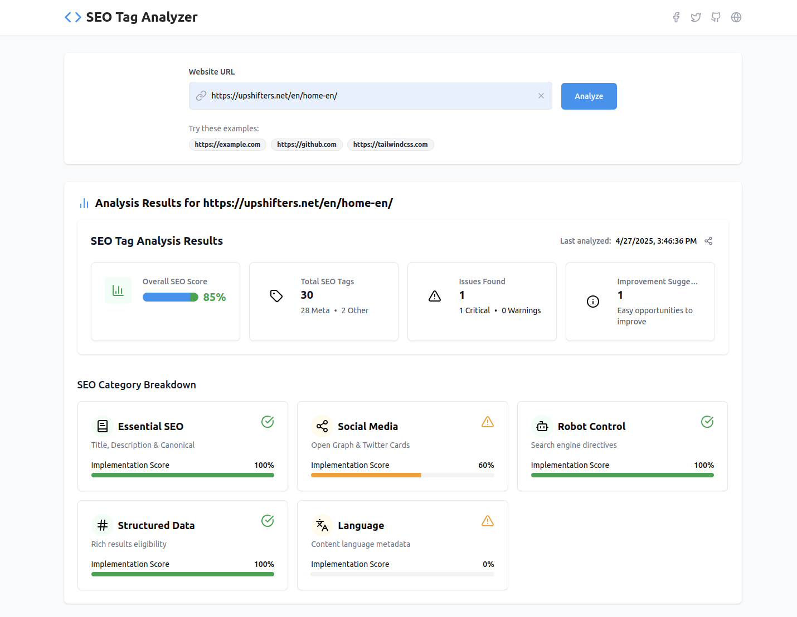
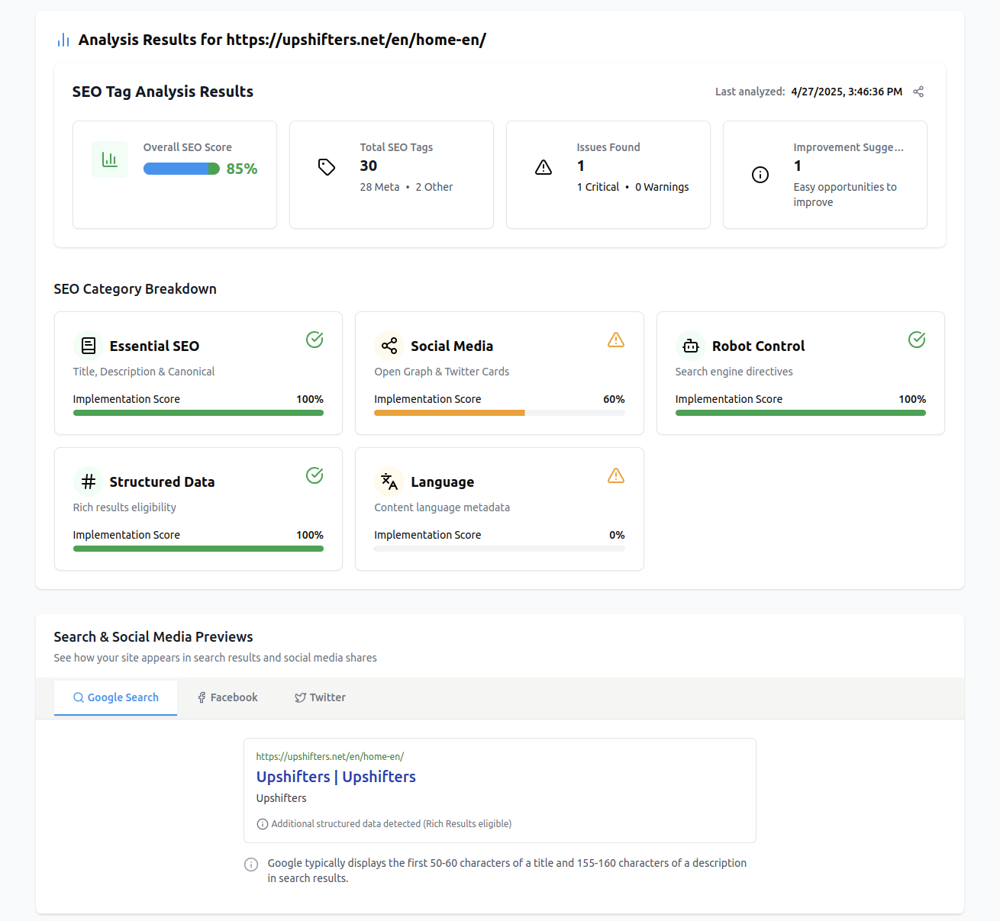
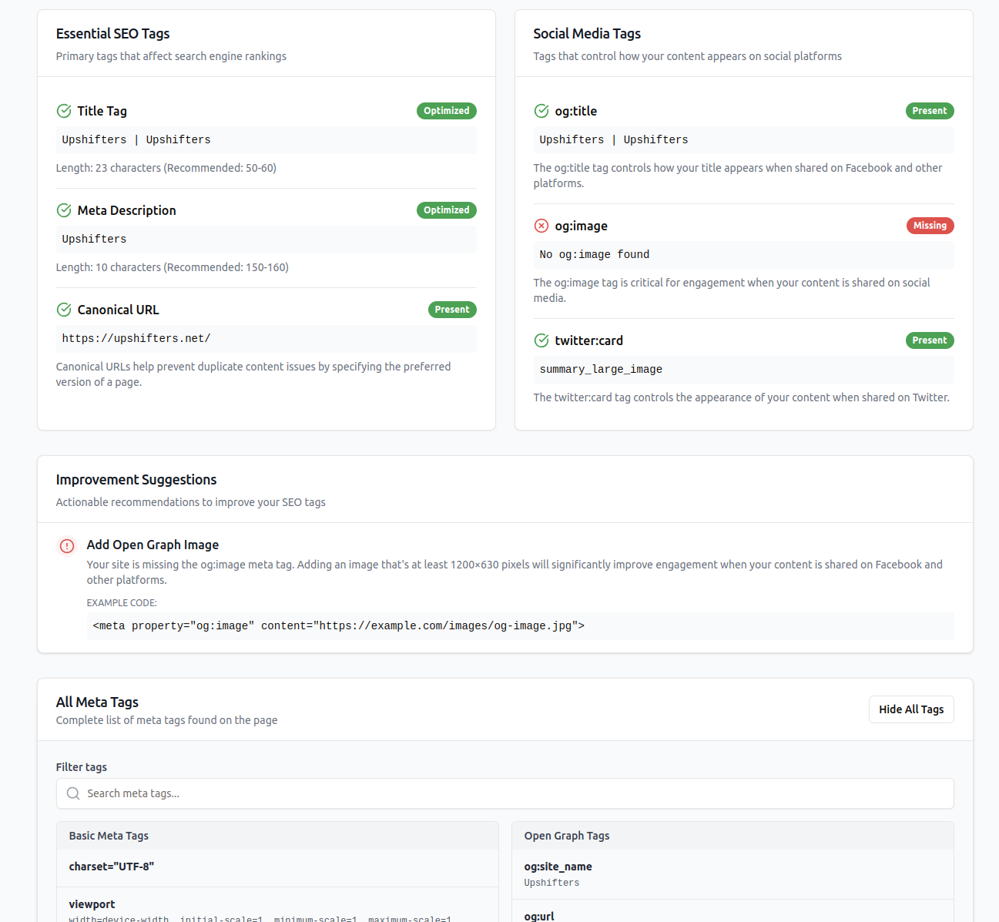

# SeoTagVision

SeoTagVision is a web application designed to analyze and optimize SEO tags for websites. It provides detailed insights into meta tags, social media tags, and structured data to help improve search engine rankings and social media visibility.

## Features
- Analyze meta tags, Open Graph tags, and Twitter cards.
- Generate SEO reports with implementation scores.
- Visualize search and social media previews.
- Built with Vite, React, and Express.js.

## Screenshots

### Meta Tag Analysis
SeoTagVision provides a detailed breakdown of all meta tags found on the page, including basic meta tags and Open Graph tags.



---

### Search & Social Media Previews
Visualize how your website appears in search results and on social media platforms like Facebook and Twitter.



---

### SEO Tag Analyzer
Get a comprehensive SEO score and implementation suggestions to improve your website's performance.



---

## Project Structure

## Prerequisites
- Node.js (v18 or higher)
- npm or yarn

## Installation
1. Clone the repository:
   ```bash
   git clone https://github.com/your-username/SeoTagVision.git
   cd SeoTagVision
   npm install
   npm run dev
   ```
